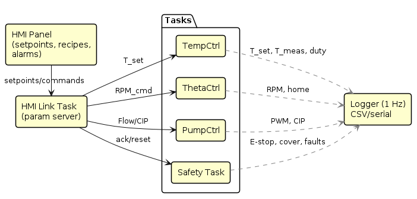
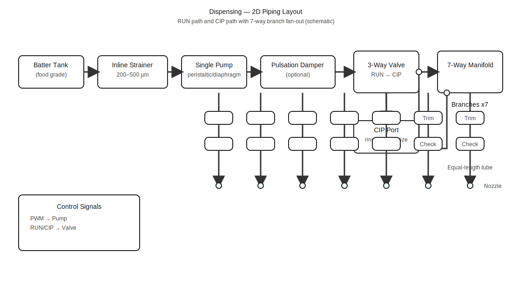
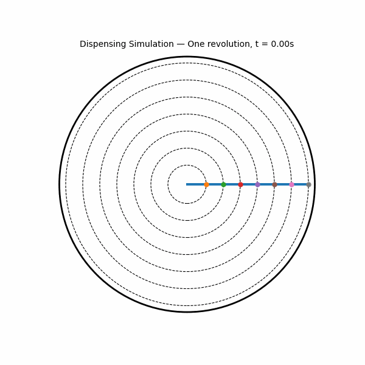

# System Architecture

## 1) Overview
The STM32 controller supervises three subsystems—thermal, motion, and dispense—while a hardware safety chain can de-energize heat and motion independent of firmware.

---

## 2) Power & Safety
- 230 VAC → EMI filter → MCB → RCD.  
- Branches: (a) 24 VDC controls; (b) AC heater via SSR → thermal cutoff → heater.  
- Hardware safety chain (E-STOP CH1/CH2 + cover NC) hard-cuts theta-EN & SSR.

---

## 3) Control Electronics (24 V domain)
STM32 (FreeRTOS), MAX31865 + PT100, SSR at 10 Hz, TB6600 + NEMA23 (θ), pump PWM, HMI/Logger.

---

## 4) Subsystems

### 4.1 Thermal (bake plate)
PT100 → MAX31865 → Temp PID → SSR → heater → plate. Target: 210–230 °C, ±3 °C under cycling.

### 4.2 Motion (θ-axis)
1.0 rev/s with homing + jerk-limited ramps; STEP/DIR/EN → TB6600 → NEMA23; hardware EN cut.

### 4.3 Dispense (pump + manifold)
Single pump → 3-way RUN/CIP → 7-way manifold → trim/check/tube → 7 nozzles; equal-length branches; outer rings get higher mL/s.

---

## 5) Software (FreeRTOS tasks)
Safety (1 kHz), TempCtrl (25 Hz; SSR 10 Hz), ThetaCtrl (timer-driven), PumpCtrl (10 Hz), HMI (2 Hz), Logger (1 Hz).

---

## 6) Timing & Key Parameters
- θ speed: **1.0 rev/s**  
- Dispense: **5 s**, **~28.3 mL/s** total (~141 mL)  
- Temp sample: **25 Hz** (PID), **10 Hz** SSR drive  
- Safety scan: **1 kHz** • Logging: **1 Hz**

---

## 7) Dispensing — 2D Drawings (SVG)
These render natively on GitHub. Place the files under `docs/architecture/svg/`.

- Top View (plate + rotating arm + 7 nozzles):  
  

- 2D Piping Layout (RUN/CIP + 7 branches):  
  

---

## 8) Video Simulation (One Revolution)
Animated visualization of a single **5 s** cycle where the arm completes **exactly one full revolution** while depositing seven concentric rings.  
Place this file at `docs/architecture/media/dispense_simulation_one_rev.gif` and embed as below:

