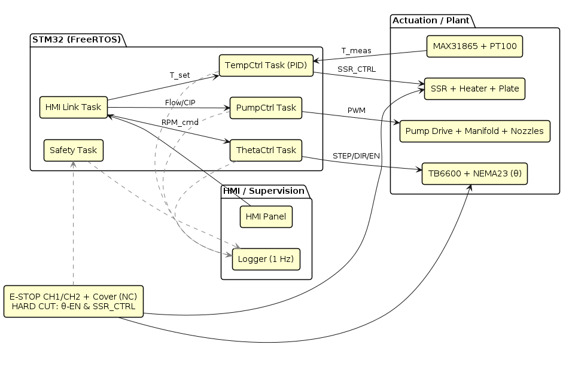
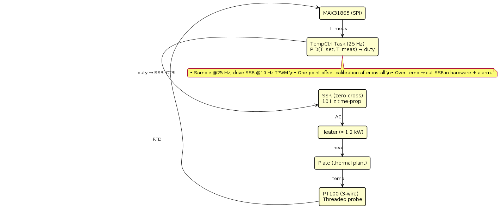
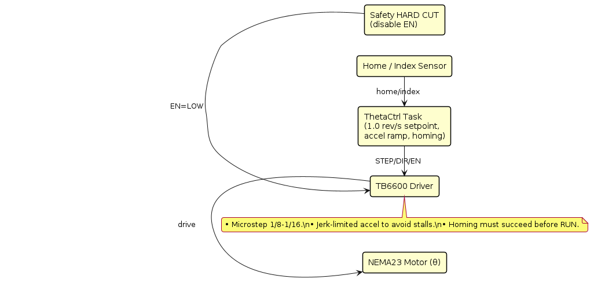
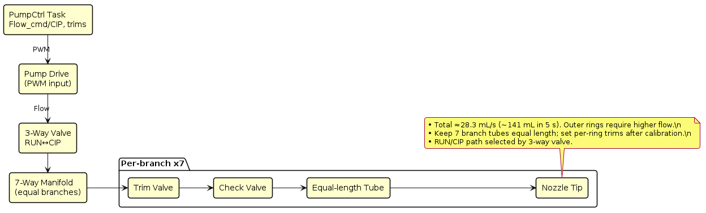
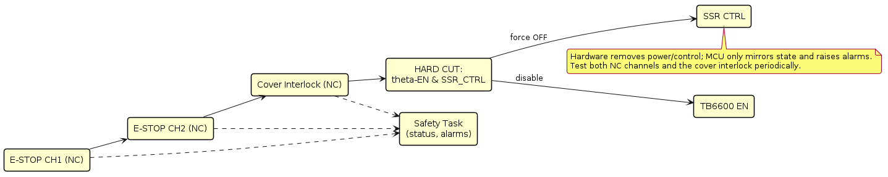
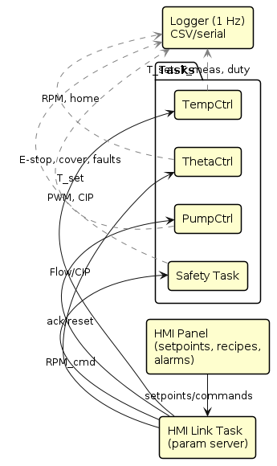

# Documentation Index

- **PRD:** [specs/PRD.md](specs/PRD.md)
- **SRS:** [specs/SRS.md](specs/SRS.md)

## Architecture
- System Overview  
  

- Power & Safety  
  

- Nozzle Arm & Rings  
  

## Control Design (modular)
- Overview  
  

- Temperature Loop  
  

- Theta Motion  
  

- Pump / Dispense  
  

- Safety Chain  
  

- HMI & Logger  
  

