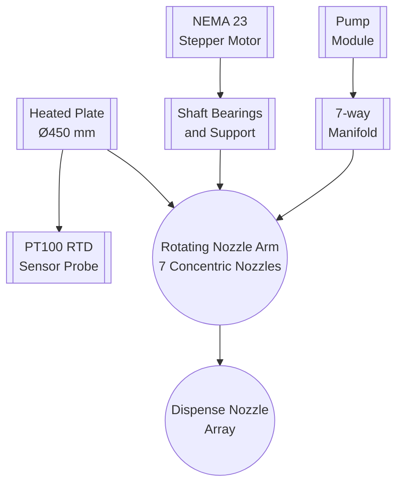
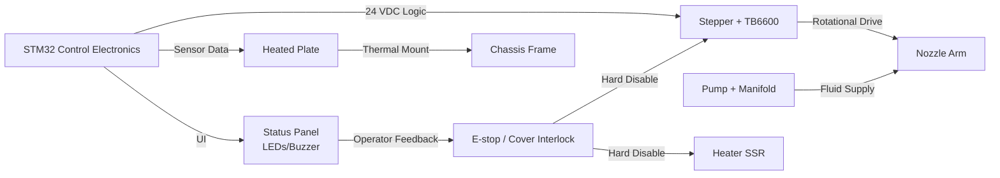

# Mechanical Design — Phase 1 (Single Plate)

## 1) Purpose
This document defines the mechanical design for the first phase of the pancake/injera-making machine POC. It focuses on a single heated plate architecture with a rotating nozzle arm.

## 2) Scope
Phase 1 is a single-plate system intended to prove the core mechanical concept:
- heated plate bake surface
- rigid rotating nozzle arm with 7 concentric dispense outlets
- motion drive for θ-axis rotation
- mechanical support, enclosure, and safety interfaces

Phase 2 will expand to a multi-plate system; that phase is noted here for roadmap alignment but is not detailed in this document.

## 3) Design Goals
- Deliver a stable, food-safe heated plate with repeatable thermal behavior
- Provide accurate, smooth θ-axis rotation for even batter deposition
- Support a 7-nozzle concentric dispensing pattern with minimal flow imbalance
- Keep moving parts shielded and easily serviceable
- Separate high-voltage heating from 24 VDC control and sensor wiring

## 4) Phase 1: Single Plate Architecture

### 4.1 Heated Plate Assembly
- Plate diameter: nominal Ø450 mm to support Ø300 mm finished injera and a safety margin.
- Surface material: stainless steel (preferably SS304 or food-grade equivalent).
- Heater integration: embedded or underneath electric heater element matched to plate thermal mass.
- Sensor integration: PT100 RTD probe pocket or surface mount in direct contact with the plate.
- Thermal insulation: use high-temperature insulation under the plate to reduce heat loss and protect the frame.
- Mounting: rigid plate support with gap for heater, sensor cabling, and safety cutoff device.

### 4.2 Nozzle Arm and Dispense Geometry
- Single rigid nozzle arm spanning the plate radius with seven concentric outlets.
- Nozzle arrangement: concentric ring pattern, with branch spacing sized for uniform ring coverage.
- Fluid path: equal-length flexible tubing from the pump manifold to each nozzle to reduce flow variation.
- Arm support: rotation about a central pivot or bearing system, with the stepper motor coupled to the shaft.
- Balance: ensure the arm is balanced around the pivot to minimize load on the stepper and bearings.
- Service access: removable or hinged nozzle arm cover to inspect nozzles and tubing.

#### Diagram: Nozzle Arm and Plate Layout

### 4.3 Motion Drive and Mechanical Transmission
- Actuator: NEMA 23 stepper motor (already acquired) sized for the nozzle arm inertia.
- Driver: TB6600 stepper driver (already acquired) configured for smooth microstepping and jerk-limited ramps.
- Coupling: rigid shaft/flange coupling between the motor and the nozzle arm drive shaft.
- Bearings: support the rotating shaft with a pair of radial bearings or bushings; include thrust support if needed.
- Homing: mechanical home switch or sensor for repeatable starting position before dispense.
- Hardware enable: stepper enable line must be hard-disabled by the safety chain when E-stop or cover interlock is activated.

#### Diagram: Phase 1 Mechanical Block Diagram

### 4.4 Chassis, Enclosure, and Safety
- Frame: robust structural chassis sized for the plate, drive components, and control electronics.
- Enclosure: protective covers around the heated plate and rotating arm, with a cover interlock switch.
- Safety chain: mechanical wiring for dual-channel E-stop and cover interlock, separate from firmware logic.
- Grounding: protective earth on chassis and all conductive panels.
- Access panels: clearly labeled service access for the plate, pump, and electrical compartments.

### 4.5 Fluid and Mechanical Interface
- Pump mounting: secure pump location inside the chassis or on a service bracket.
- Manifold: fixed 7-way dispense manifold mounted near the base of the nozzle arm.
- Nozzle mounting: nozzles fastened to the rotating arm with food-grade fittings and easy replacement.
- Trim valves: mechanical flow adjustment valves on each nozzle branch are recommended for calibration.

### 4.6 Operator Interface and Status Panel
- Status panel: visible status LEDs, buzzer, and/or a small display near the operator.
- Indicators: power on, heat active, motion enabled, fault, E-stop active, cover open.
- Controls: start/stop cycle buttons and an emergency stop (hardware E-stop separate from firmware commands).

## 5) Phase 2: Multi-Plate Roadmap (Not Detailed Here)
- Phase 2 will generalize the architecture to multiple heated plates and coordinated dispense heads.
- The multi-plate design will require additional motion systems, plate selection mechanics, and more complex thermal management.
- This document does not specify Phase 2 mechanics; it serves as a roadmap placeholder only.

## 6) Key Mechanical Requirements for Phase 1
- Plate size: supports Ø300 mm finished product, minimum Ø450 mm assembly.
- Rotation speed: 1.0 rev/s with stable motion and minimal vibration.
- Dispense cycle: 5.0 seconds for a full shoot.
- Load capacity: support the weight of the nozzle arm, tubing, and fluid supply without mechanical deflection.
- Safety isolation: separate 230 VAC heater components from the operator and control circuitry.

## 7) Next Steps
- Create detailed CAD sketches or drawings for the plate assembly, nozzle arm, and chassis.
- Define bearing, shaft, and coupling specifications based on exact arm geometry.
- Validate the plate heater and sensor integration with a thermal model or prototype test.
- Review service access and enclosure design for maintenance and safety compliance.
